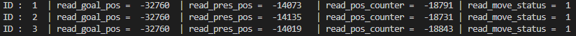
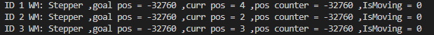

# FEETECH STS series Serial Servo
#FEETECH #STS series #STS3032 #Serial Servo #Steper motor #Serial stepper motor

FT serial servo library using the commands of the "Hansrobot protocol interface" to provide hooks for HansRobot Elfin robot arm on Windows, Mac or Linux.

Same as stepper motor with 4096(0 - 4095) steps and the driver board integrated inside the motor, so that the program can read the goal position, current position and move status from the motor. 

This servo motor with 4 working mode, 
1. DC motor mode, 
2. PWM servo mode. 
3. Serial servo mode and 
4. Stepper serial servo mode (Infinite serial servo mode). 

I'm currently developing a python library for servo mode and infinite servo mode. Hope can publish later.

## Features:
1. DC motor mode
2. Serial servo mode
3. Stepper serial servo mode (Infinite serial servo mode)
4. Less time.delay command is used, smoother action
5. More flexibility, such as the user can change the speed at any point

## STS serial motor default setting:
- Servo ID = 1

- Baudrate = 1000000

- Work mode = 0 = servo mode

- Min Position Limit = 0

- Max Position Limit = 4095

## Usage : Take the app.py as an example
1. Set the servo ID for each motor with the "_write_servo_chg_setting.ipynb"
    e.g. ID = 2, 3...
2. Run the app.py

## Motor's info output
The read_mv_status function requires 21 bytes of data from the servo, which is mainly used to check the motion status of the motor


The read_all_info function requires all 87 bytes data from the servo and literally can print out all the data on the terminal



## read_pos_ctr_offset
Use read_pos_ctr_offset to set read_pos_ctr (position counter) to zero before the motor starts. The position counter will not display correctly when the value is greater than about 31000 (0xffff / 2 - offset), but will return to normal when the value is less than 31000.
```python
def change_mod(self, mode):
    if mode == 0:
        int_arr = [0xFF, 0xFF, self.ID, 4, self.WRITE_CMD, 33, mode, 0x00]
        self.srw.send(int_arr)
        int_arr = [0xFF, 0xFF, self.ID, 5, self.WRITE_CMD, 11, 0xff, 0xf, 0x00]
        self.srw.send(int_arr)
        self.read_all_info()
        print("ID ", self.ID, " change mode", mode, "ok")
    if mode == 3:
        int_arr = [0xFF, 0xFF, self.ID, 4, self.WRITE_CMD, 33, mode, 0x00]
        self.srw.send(int_arr)
        int_arr = [0xFF, 0xFF, self.ID, 5, self.WRITE_CMD, 11, 0x00, 0x00, 0x00]
        self.srw.send(int_arr)
        self.read_all_info()
        self.read_pos_ctr_offset = self.read_pos_ctr
        print("ID ", self.ID, " change mode", mode, "ok")
```
## Youtube:
https://youtu.be/9ao2Iik1vsE